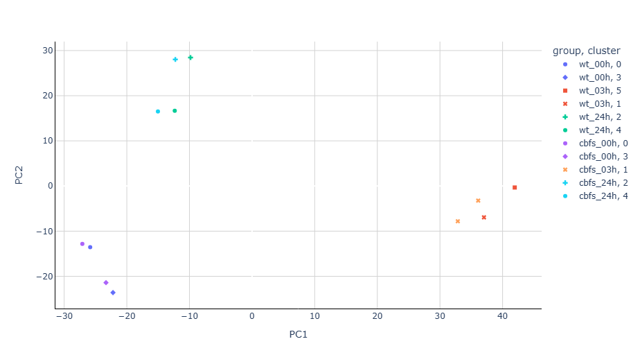
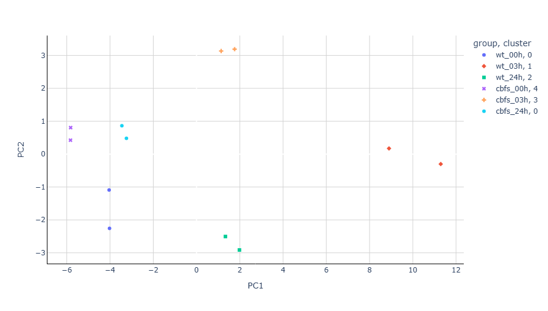

# Differential expression analysis

## Requirements

- R, DESeq2, tidyverse

- Python libraries

&nbsp;   - pandas

&nbsp;   - numpy

&nbsp;   - matplotlib

&nbsp;   - seaborn

&nbsp;   - scikit-learn

    - plotly

## Description

Work description: use R libraries to perform differential expression analysis and then demonstrate improved clusterization using PCA and k-means clustering methods.

Input data - data/Readcounts.txt

1. Differential expression analysis in R with filtering genes (see gene\_expression.Rmd)
2. PCA and clustering (see analysis\_diff\_expression.ipynb)

## Results

Without differential expression analysis, samples within one cluster are grouped mainly by time point, mixing control and treated conditions.

After applying differential expression analysis, PCA and k-means organize the samples into the correct groups by control vs treated.

 Gene expression heatmap

 